# DIU21
Prácticas Diseño Interfaces de Usuario 2020-21 (Tema: Turismo) 

Grupo: DIU3_We-Robot.  Curso: 2020/21 

Proyecto: 
>>> Tapeo por Granada

Descripción: 
>>> El proyecto se basa en la idea de la Ruta de la Tapa en Granada. Esta app
favorecerá tanto el turismo de Granada como a la hostelería granadina.
La app mostrará un mapa de la ciudad granadina con los diferentes puntos a visitar
de la ruta. Cada punto de la ruta corresponde a un restaurante.

Logotipo: 
>>> Opcionalmente si diseña un logotipo para su producto en la práctica 3 pongalo aqui

Miembros
 * :bust_in_silhouette:   Pablo Rodriguez Avila     :octocat:     
 * :bust_in_silhouette:  Ahmed El Moukhtari Koubaa     :octocat:

----- 

# Proceso de Diseño 

## Paso 1. UX Desk Research & Analisis 

1.a Competitive Analysis

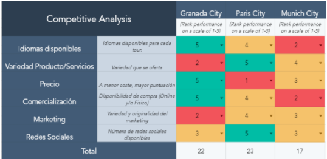 
-----

>>> Describe brevemente características de las aplicaciones que tienes asignadas, y por qué has elegido una de ellas (150-300 caracteres) 

Para realizar la comparación hemos seleccionado la página granada-city-tour. Dicha
elección se ha basado principalmente en algunos de los requisitos que se nos solicitaban en
el guión de dicha práctica; como: ser una plataforma que ofrece actividades de ocio, reserva
de entradas, tour guiados, etc.
Además, la valoración final de Granada City Tour es bastante alta, aunque la de París sea
un punto más alto, nos quedamos con Granada porque es una alternativa local que
podemos explotar más a la hora de estudiarla.
En cuanto a las alternativas, hemos seleccionado páginas muy similares para localizaciones
diferentes en otros países por ser una alternativa global

1.b Persona
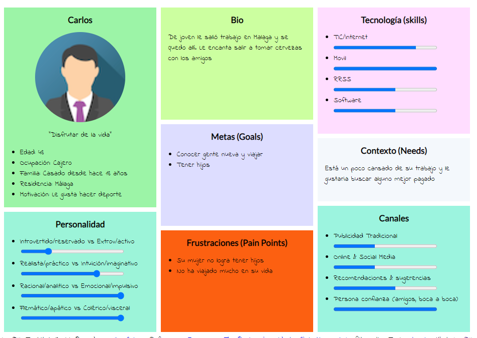 
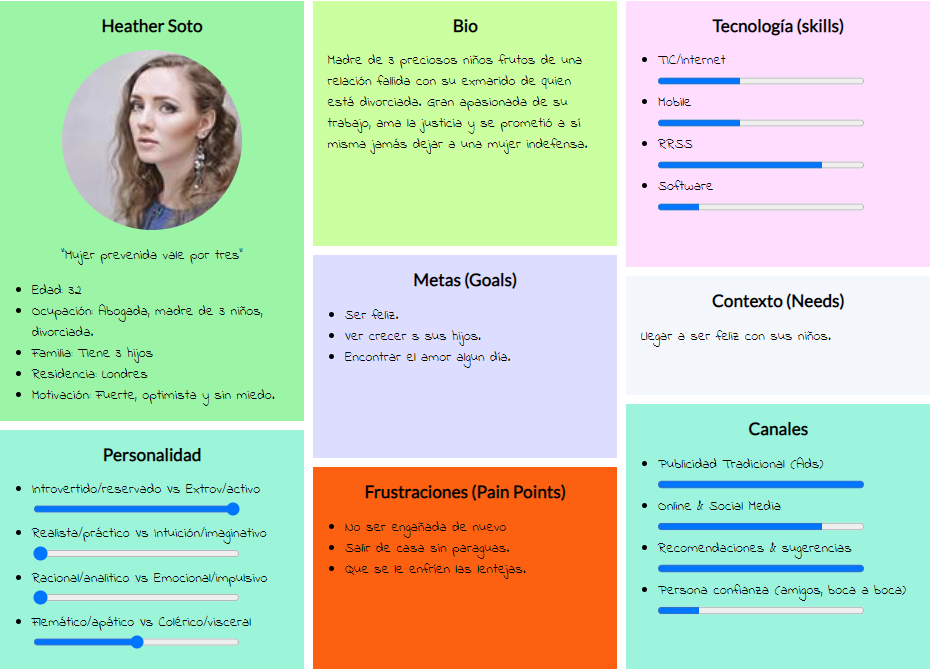 
-----

>>> Comenta brevemente porqué has seleccionado a esas personas y sube una captura de pantalla de su ficha  (80-150 caracteres)

Hemos creado aleatoriamente a dos personajes, uno de ellos es Carlos y otro es Heather.
Carlos es español está felizmente casado y no tiene hijos mientras que Heather es inglesa
con 3 hijos y ,además, divorciada. Teniendo en cuenta la diferencia de rasgos personales
de cada personaje, podremos obtener una información más relevante y valiosa.

1.c User Journey Map

Journey Map de Carlos
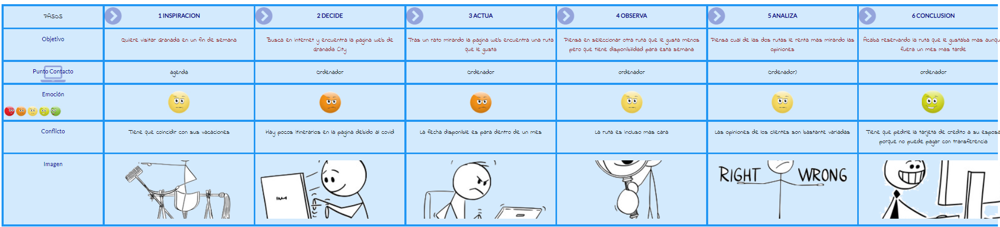 
Journey Map de Heather
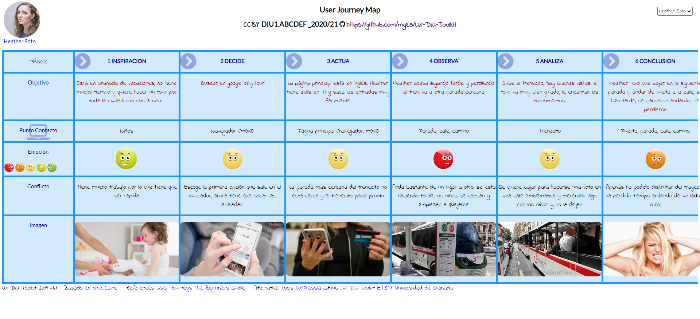 
----

>>> Comenta brevemente porqué has escogido estas dos experiencias de usuario (y si consideras que son habituales) (80-150 caracteres) 
- Heather: es abogada y tiene unos días libres, viaja a Granada con sus niños pero al
llegar un caso que llevaba se complica y su cliente requiere de su atención. Por no
suspender sus vacaciones Heather decide teletrabajar hasta volver. En Granada
Heather decide ir con sus 3 hijos a realizar un city tour, pero no tiene mucho tiempo,
usa Granada-City-Tour.
- Carlos: es cajero y decide visitar Granada un fin de semana. Carlos mira en su
agenda y selecciona algún fin de semana que tenga libre. Indagando, Carlos
encuentra la web de Granada-City-Tour aunque hay pocos itinerarios en la página
debido al covid. Tras un rato mirando encuentra una ruta que le gusta pero la fecha
disponible es para dentro de un mes. Como a Carlos le gustaría irse pronto, busca
otra ruta más próxima, lo malo es que es más cara. Acaba analizando cual de las
dos rutas le conviene más mirando opiniones de los clientes. Finalmente se decanta
por la primera ruta aunque sea dentro de un mes. Por otro lado, a la hora de pagar
Carlos tiene algún problema debido a los escasos métodos de pago en la página

1.d Usability Review
 
----
>>>  Revisión de usabilidad: (toma los siguientes documentos de referncia y verifica puntos de verificación de  usabilidad
>>>> SE deben incluir claramente los siguientes elementos
>>> - Enlace al documento:  (sube a github el xls/pdf) 
>>> - Valoración final (numérica): 72
>>> - Comentario sobre la valoración:  (60-120 caracteres)
Hemos realizado dicha review desde el punto de vista de Heather al hacer uso de granadacity-tour. Obtenemos como resultado final: “72 Good”, lo cual concuerda con el perfil de
Heater ya que es una mujer de 32 años, inglesa, que se maneja bien con redes sociales,
páginas web, etc. Tal vez echemos en falta un mecanismo de búsqueda que nos permita
encontrar lo que buscamos más rápidamente y algunas recomendaciones populares para
reducir el tiempo de decisión. También se puede destacar la facilidad para poder volver al
inicio de la página o para poder añadir al carrito las reservas que queremos

## Paso 2. UX Design  

 2.a Feedback Capture Grid / EMpathy map / POV
----
Realizamos una malla receptora de información en el proceso de ideación
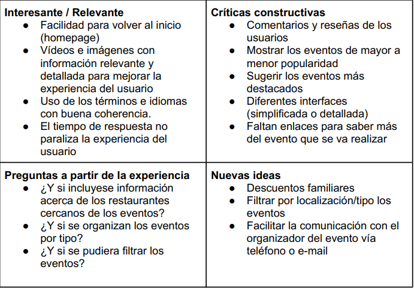
  
    
>>> Propuesta de valor 
>>> 
El proyecto se basa en la idea de la Ruta de la Tapa en Granada. Esta app
favorecerá tanto el turismo de Granada como a la hostelería granadina. Estará
enfocada en personas no residentes en Granada, principalmente estará destinada a
extranjeros provenientes de Europa o Asia.
La app mostrará un mapa de la ciudad granadina con los diferentes puntos a visitar
de la ruta. Cada punto de la ruta corresponde a un restaurante. Esta ruta empezará
en la Chana y terminará en el Zaidín de manera que los visitantes acabarán
recorriendo la ciudad. La ruta contendrá restaurantes situados en puntos de interés
turístico como la Alhambra o el Albayzín, fomentando así tanto el interés
gastronómico como cultural.
El usuario al completar la ruta podrá dejar comentarios acerca de ella y haciendo
propuestas para mejorarla. Esta propuesta puede contener la ruta modificada oincluso crear una de cero. Estas propuestas se añadirán a las sección de Rutas de
la Comunidad.
Frecuentemente se ofrecerán además de las rutas oficiales, rutas basadas en estas
pero con modificaciones, con nuevas paradas o sin algunas antiguas, por ejemplo,
si se prevé un evento interesante se podría cambiar la ruta para pasar cerca de
dicho evento.

 2.b ScopeCanvas
----
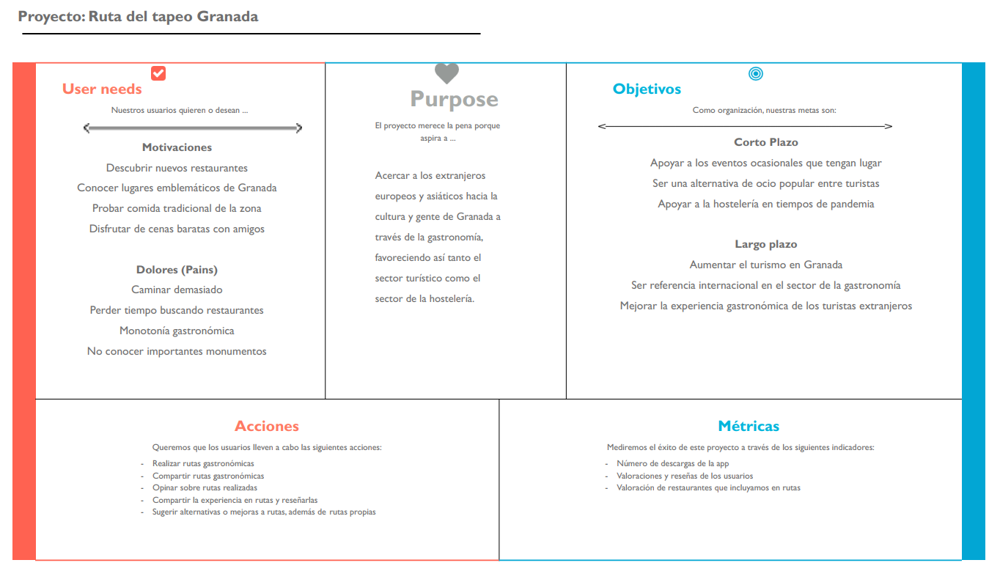

 2.b Tasks analysis 
-----
En lugar de un User/Task flow, elegimos la matriz de tareas/usuario debido a que facilita
la representación de la información.
L = Low
M = Medium
H = High
>>> 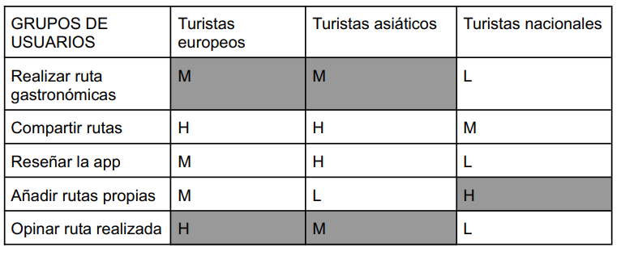

 2.c IA: Sitemap + Labelling 
----
>>> Sitemap
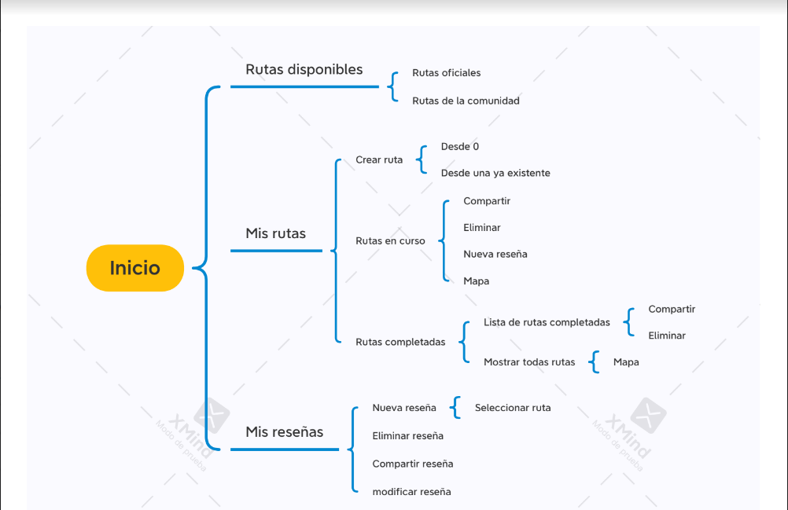

>>> Labelling  

Término | Significado     
| ------------- | -------
Inicio  | Contiene información sobre rutas yreseñas, nos redirige a accionesrelacionadas con estas.
Rutas disponibles | Contiene información sobre las rutas que se pueden realizar actualmente
Mis rutas | Gestiona las rutas del usuario
Mis reseñas | Gestiona las reseñas del usuario
Rutas oficiales | Muestra las rutas creadas por el sistema
Rutas de la comunidad | Muestra las rutas creadas por losusuarios y permite llevar acciones sobre ellas
Mapa | Muestra gráficamente las rutas, es un mapa político con líneas y puntos, donde los puntos son restaurantes de tapas y las líneas caminos para llegar de un nodo a otro
Seleccionar ruta | Permite escoger la ruta sobre la que se llevarán a cabo las acciones
Añadir ruta | Añade una ruta a las rutas de usuario
Compartir | Genera un mensaje con información relevante sobre una ruta, dicho mensaje se puede enviar por otras aplicaciones (Whatsapp, Telegram, Instagram, Facebook, etc)
Crear ruta | Permite al usuario crear una ruta propia
Rutas en curso | Muestra las rutas que ha comenzado el usuario, puede haber más de una iniciada a la vez
Rutas completadas | Gestiona las rutas que el usuario ya completó
Desde 0 | Crea una ruta completamente nueva, desde cero
Desde una ya existente | Crea una ruta basándose en otra ruta que ya existe, añadiendo nuevos nodos, eliminando viejos, nuevas uniones, etc
Lista de rutas completadas | Muestra una lista con todas las rutas que el usuario haya completado
Mostrar todas rutas | Muestra todas las rutas del usuario
Eliminar | Permite eliminar una ruta
Nueva reseña | Crea una nueva reseña
Eliminar reseña | Elimina una reseña anterior
Compartir reseña | Genera un mensaje con toda la información relativa a una reseña y permite enviarlo por distintos medios(Whatsapp, Telegram, Instagram, Facebook, etc)
Modificar reseña | Modifica el contenido de una reseña previa
  

 2.d Wireframes
-----

>>> Plantear el  diseño del layout para Web/movil (organización y simulación ) 
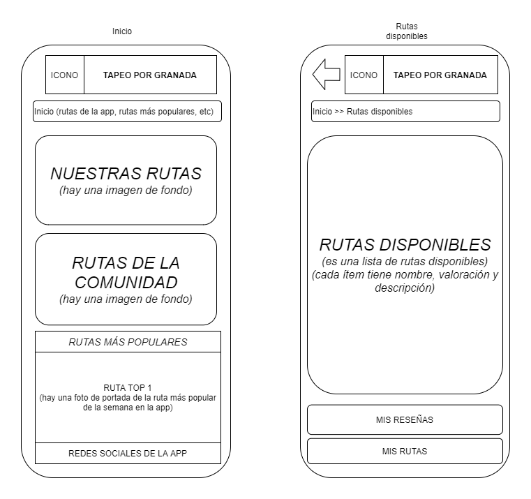
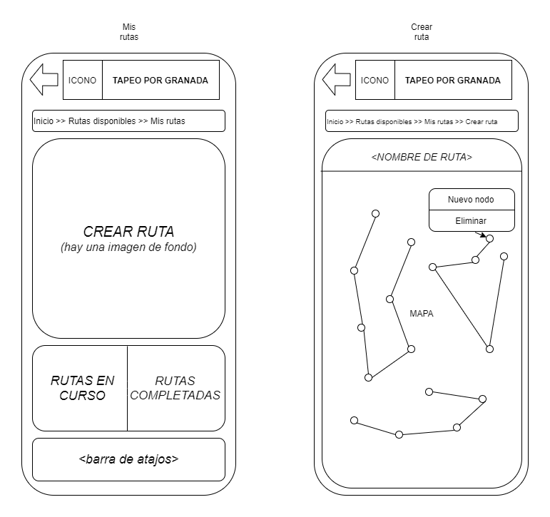
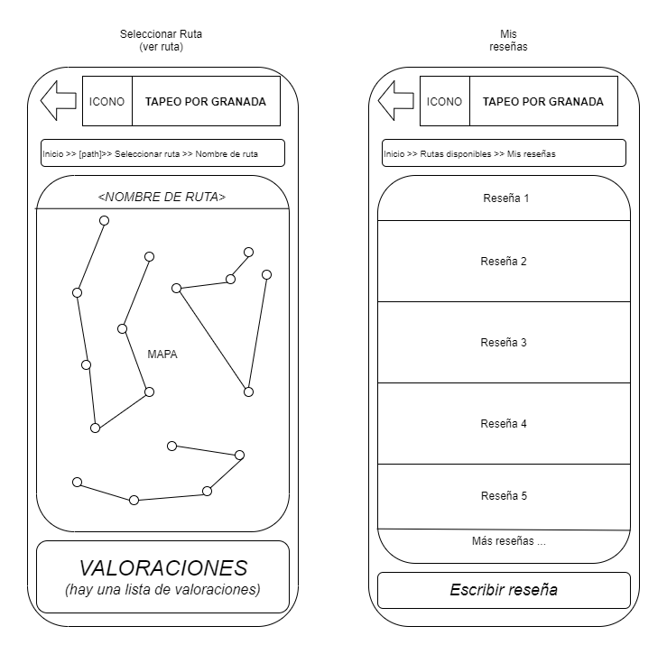

## Paso 3. Mi UX-Case Study (diseño)

 3.a Moodboard
-----
Para la creación del Moodboard utilizamos el siguiente sitio web donde puede consultar nuestro diseño: https://app.milanote.com/1LBKAK17SJQPes/spontour

>>>**Logotipo**
>>>
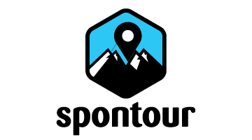
El logotipo de la aplicación lo obtuvimos en un generador de logotipos que utiliza IA para orginar un logotipo a través de unas determinadas palabras claves: https://namelix.com/
El logotipo en un principio no lo usaríamos como cabecera de Twitter ya que es un logo que encajaria más bien en una foto de perfil que en un banner de Twitter, ya que este es un rectángulo bastante alargado y no concordaría con el diseño de nuestro logotipo.

>>>**Fuentes**
>>>
Las posibles fuentes que pensamos en usar son: 
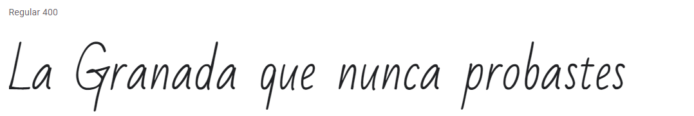
https://fonts.google.com/specimen/Bad+Script
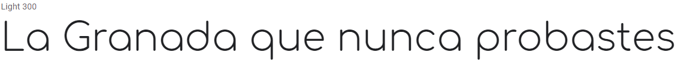
https://fonts.google.com/specimen/Comfortaa
El principal objetivo al escoger estas fuentes es que fueran fuentes que legibles para que el mensaje llegara de forma sencilla al usuario.

>>> **Paletas de colores**
La paleta de colores escogida es:
-  `#2f8f8b`
-  `#96d219`
-  `#8f004`
Hemos seleccionado el color azul (#2F8F8B) como color principal porque representa a la ciudad de Granada (buen tiempo y clima, cielo despejado, etc). El verde representa los jardines de la Alhambra y junto al rojo la bandera de Granada.
Por otro lado, escogemos el azul como color principal por significar amabilidad, simpatía y ser el favorito de la mayoría y con intención de que capte la atención de los turistas del norte. El color verde hace referencia a la ciudad de Granada y a su naturaleza. El color rojo representa comidas  exóticas y algo nuevo.

>>> **Imágenes inspiradoras**
>>> 

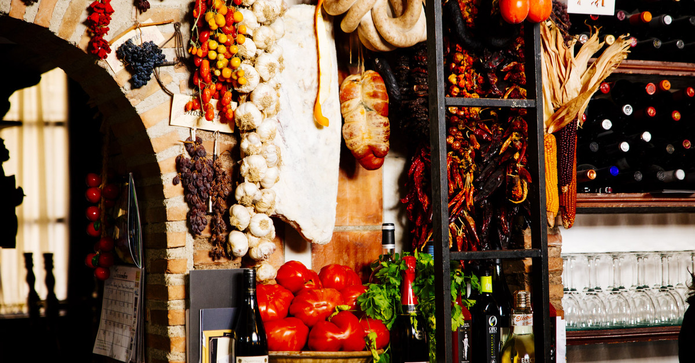
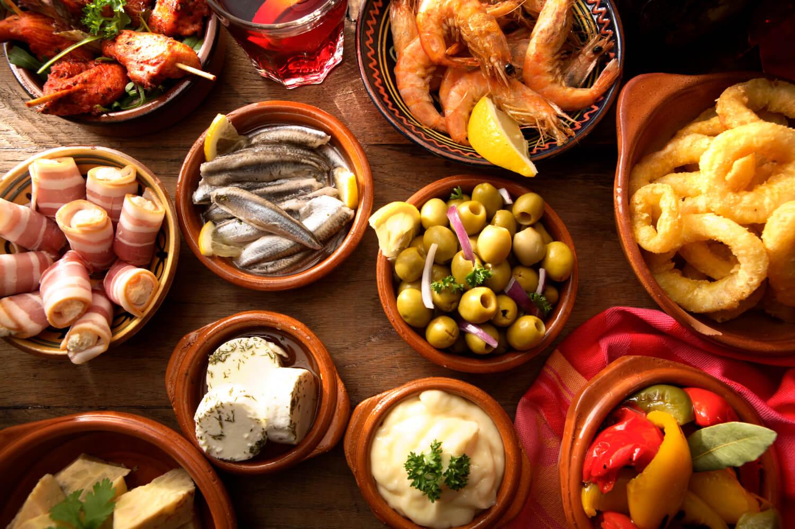

Estas imágenes mezclan los conceptos que queremos reflejar en nuestra app, los lugares icónicos del turismo en Granada junto a su gastronomía.

  3.b Landing Page
----

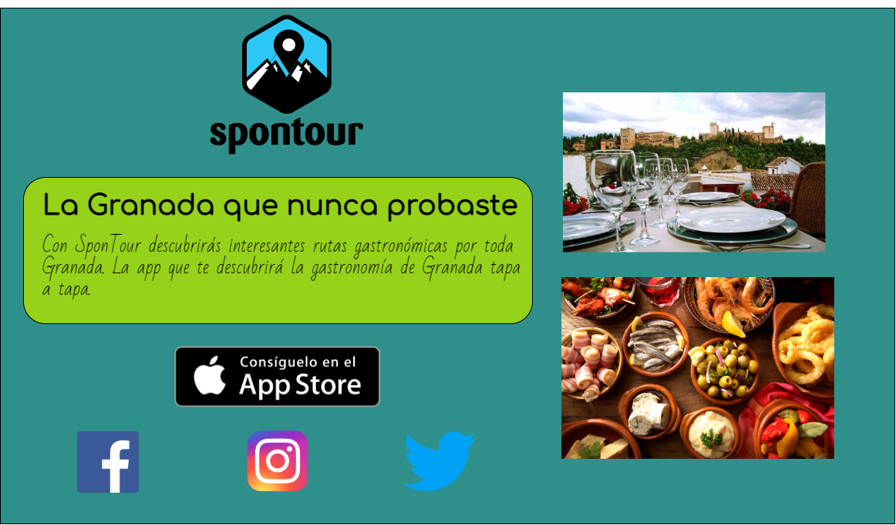

 3.c Guidelines y patrones
---
>>> **Guidelines**
>>> 
Para el diseño de nuestra app utilizaremos los Guidelines de Apple en sistemas iOS.
Los principales conceptos que usa iOS en su diseño son:
-Claridad: el texto debe ser legible en cualquier tamaño, los iconos deben ser precios y los adornos tienen que ser apropiados.
-Profundidad: varias capas distintas apoertar una visión jerárquica y facilitan al usuario la comprensión.
-Deferencia: es importante un movimiento fluido y nítido.

>>> **Patrones**
>>> 
En concreto estudiamos patrones para la barra de navegación de la app y también para la búsqueda en las rutas de la comunidad.
Para la barra de navegación mostraremos una estructura jerárquica donde se muestran los niveles de profundidad.
Respecto a la búsqueda de las rutas de la comunidad, diseñaremos una caja de búsqueda donde el usuario podra escribir etiquetas que posteriormente se buscarán concordancias. Estas etiquetas pueden ser el nombre de la ruta, los nombres de los sitios por donde pasa la ruta o incluso el nombre del usuario.
Por otro lado, tambien implementaremos patrones para mostrar items en lista con scroll.

  3.d Mockup
----
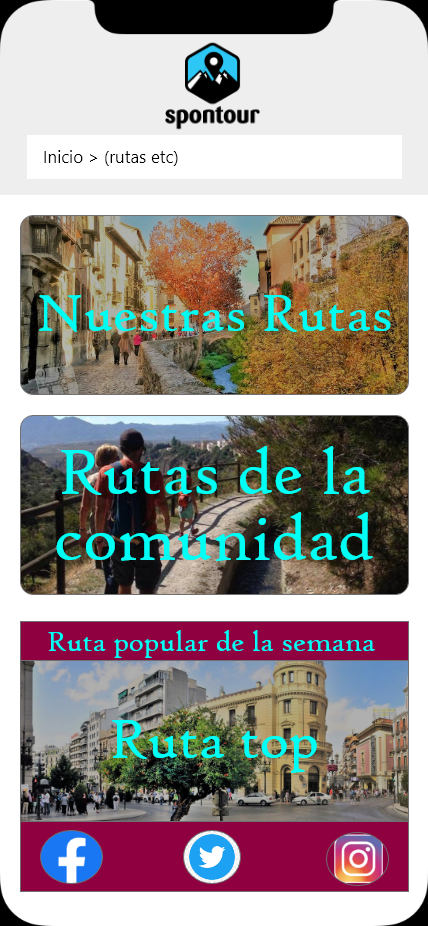 
 
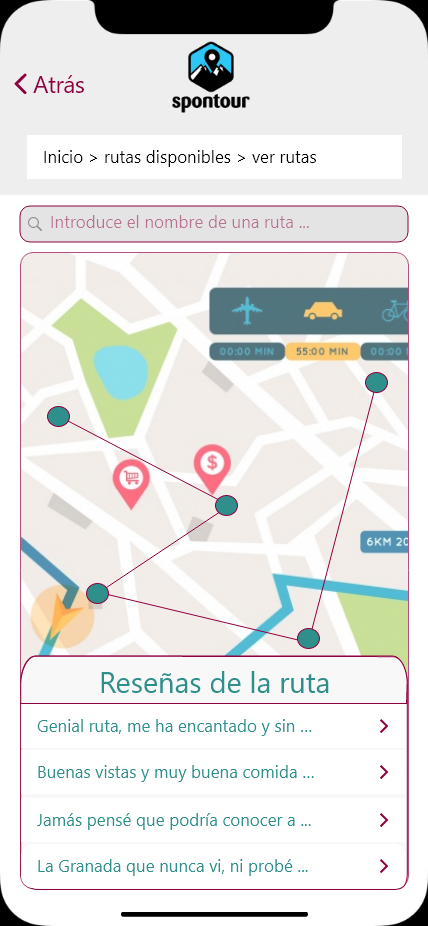 
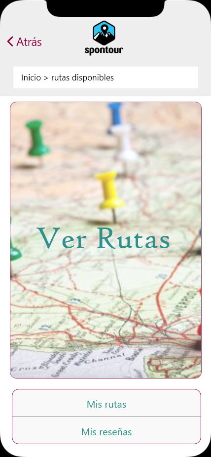 
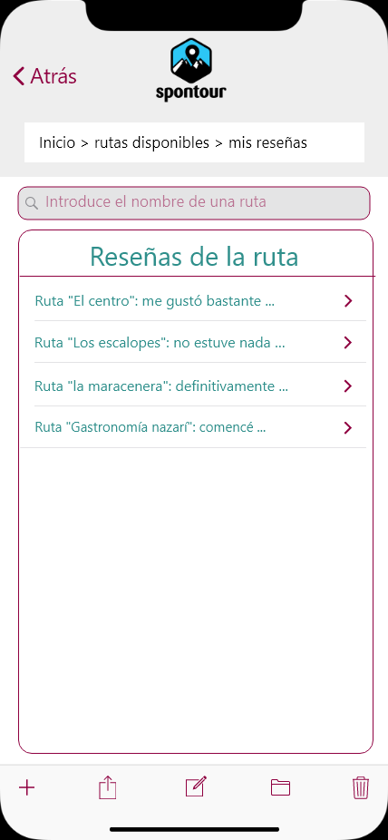 

 
3.e My UX-Case Study
>>> En el siguiente video se puede observar la transición entre pantallas:
>>> https://drive.google.com/file/d/16xLBVp5mZkHaBh2inltgJbt2CQrTNQtL/view?usp=sharing

## Paso 4. Evaluación 

# DIU 2020-2021

# Equipo: WeRobot

## Caso 1: GRANADING
[(Mastodontes)](https://github.com/eProw/DIU21)

Granading es una aplicación de turismo para gente interesada en la ciudad de Granada, centrada en ofrecer una experiencia fluida y satisfactoria para visitar la provincia con todo lujo de detalles.

## Caso 2: SponTour
[(We\_Robot)](https://github.com/Pravila00/DIU21)

Spontour es una aplicacion diseñada para conocer Granada desde el punto de vista gastronómico. Ofrece rutas donde cada parada es un restaurante donde puedes comer y disfrutar de la ciudad de Granada. Además, el usuario tiene la capacidad de añadir sus propias rutas, compartirlas y de reseñar otras rutas. Con SponTour descubrirás una Granada que nuna antes habías visto.

## User Testing

Para llevar a cabo la parte de testing, hemos creado 4 perfiles de usuarios variados y distintos entre sí de manera aleatoria
mediante la tirada de dados. El siguiente paso fue identificar dichos perfiles con personas del mundo real para tener una 
opinión objetiva y lo más precisa posible.

Estas 4 personas han reseñado diversos aspectos de las aplicaciones que hemos evaluado. Las reseñas se han realizado dando
un valor entre 1 y 5, donde 1 es lo peor y 5 lo mejor. 

Mediante estas reseñas hemos podido evaluar las aplicaciones y compararlas entre ellas. Hemos resalizado pues un System 
Usability Scale Test (SUS) y un A/B testing. Los resultados de las pruebas se describen a continuación.

  ### **1. Usuarios ficticios + Rol Play**

  Nuestros usuarios ficticios tendrán las siguientes características:

  - Laura: :Persona sociable, le gusta pasear y es una persona feliz.
  - Paco: Persona solitaria, le gusta bailar y es una persona enfadada.
  - Luis: Persona trabajadora, le gusta aprender idiomas y es una persona triste.
  - Sara: Persona familiar, le gusta tomar fotos y es asustadiza.

  | Usuario | Sexo/ Edad | Ocupación | Experiencia internet | Plataforma | Perfil cubierto | Test |
  | --- | --- | --- | --- | --- | --- | --- |
  | Laura | 23/Mujer | Enfermera | Intermedio | Windows | -Sociable -Le gusta pasear-Feliz | A |
  | Paco | 43/Hombre | Abogado | Bajo | Phone | -Solitario -Bailar es su pasión-Enfadado/agobiado | B |
  | Luis | 27 / Hombre | Informático | Avanzado | Linux | ·Trabajdor ·Le gustan los idiomas·Triste | A |
  | Sara | 50 /Mujer | Fotógrafa | Media | Mac | ·Familiar ·Le gusta la fotografía·Asustadiza | B |

  ###

  ###

  ### **2. System Usability Scale Test (SUS)**

  Para calcular la valoración final de cada SUS, seguimos las indicaciones en: **https://usabilitygeek.com/how-to-use-the-system-usability-scale-sus-to-evaluate-the-usability-of-your-website/**

  - ### 2.1 Usuario Laura (Evalúa A WeRobot)

  |    | PREGUNTAS | 1 | 2 | 3 | 4 | 5 |
  | --- | --- | --- | --- | --- | --- | --- |
  | 1 | Creo que me gustará visitar con frecuencia este website || | | x | |
  | 2 | Encontré el website innecesariamente complejo || x | | | |
  | 3 | Pensé que era fácil utilizar este website || | | x | |
  | 4 | Creo que necesitaría del apoyo de un experto para recorrer el website |x | | | | |
  | 5 | Encontré las funciones del website bastante bien integradas || | x | | |
  | 6 | Pensé que había demasiada inconsistencia en el website |x| | | | |
  | 7 | Imagino que la mayoría de las personas aprenderían muy rápidamente a utilizar el website | | | | x | |
  | 8 | Encontré el website muy grande al recorrerlo || x | | | |
  | 9 | Me sentí muy confiado en el manejo del website  || | | | x |
  | 10 | Necesito aprender muchas cosas antes de manejarse en el website  | x| | | | |
  |   | Valoración final | 33 x 2.5 = 82.5 |||||

  ###

  ###

  ###

  - ### 2.2 Usuario Paco (Evalúa B Mastodonte)

  |  | PREGUNTAS | 1 | 2 | 3 | 4 | 5 |
  | --- | --- | --- | --- | --- | --- | --- |
  | 1 | Creo que me gustará visitar con frecuencia este website | | | x | | |
  | 2 | Encontré el website innecesariamente complejo | | | | | x |
  | 3 | Pensé que era fácil utilizar este website | | | | x | |
  | 4 | Creo que necesitaría del apoyo de un experto para recorrer el website | x | | | | |
  | 5 | Encontré las funciones del website bastante bien integradas | | | x | | |
  | 6 | Pensé que había demasiada inconsistencia en el website | x | | | | |
  | 7 | Imagino que la mayoría de las personas aprenderían muy rápidamente a utilizar el website | | x | | | |
  | 8 | Encontré el website muy grande al recorrerlo | x | | | | |
  | 9 | Me sentí muy confiado en el manejo del website  | | | | x | |
  | 10 | Necesito aprender muchas cosas antes de manejarse en el website  | | | x | | |
  |  | Valoración final | 25 x 2.5 = 62.5 || | | |

  ###

  ###

  ###

  ###

  ###

  - ### 2.3 Usuario Luis (Evalúa A WeRobot)

  |  | PREGUNTAS | 1 | 2 | 3 | 4 | 5 |
  | --- | --- | --- | --- | --- | --- | --- |
  | 1 | Creo que me gustará visitar con frecuencia este website | | | X | | |
  | 2 | Encontré el website innecesariamente complejo | | X | | | |
  | 3 | Pensé que era fácil utilizar este website | | | | | X |
  | 4 | Creo que necesitaría del apoyo de un experto para recorrer el website | X | | | | |
  | 5 | Encontré las funciones del website bastante bien integradas | | | | | X |
  | 6 | Pensé que había demasiada inconsistencia en el website | | X | | | |
  | 7 | Imagino que la mayoría de las personas aprenderían muy rápidamente a utilizar el website | | | | | X |
  | 8 | Encontré el website muy grande al recorrerlo | | X | | | |
  | 9 | Me sentí muy confiado en el manejo del website  | | | | | X |
  | 10 | Necesito aprender muchas cosas antes de manejarse en el website  | X || | | |
  |  | Valoración final | 35 x 2,5 = 87,5 | | | | |

  ###

  ###

  ###

  - ### 2.4 Usuario Sara (Evalúa B Mastodontes)

  |    | PREGUNTAS | 1 | 2 | 3 | 4 | 5 |
  | --- | --- | --- | --- | --- | --- | --- |
  | 1 | Creo que me gustará visitar con frecuencia este website || | | X | |
  | 2 | Encontré el website innecesariamente complejo | | X | | | |
  | 3 | Pensé que era fácil utilizar este website | | | | X | |
  | 4 | Creo que necesitaría del apoyo de un experto para recorrer el website | | X | | | |
  | 5 | Encontré las funciones del website bastante bien integradas | | | | | X |
  | 6 | Pensé que había demasiada inconsistencia en el website | X | | | | |
  | 7 | Imagino que la mayoría de las personas aprenderían muy rápidamente a utilizar el website | | | | | X |
  | 8 | Encontré el website muy grande al recorrerlo | | | X | | |
  | 9 | Me sentí muy confiado en el manejo del website  | | | | | X |
  | 10 | Necesito aprender muchas cosas antes de manejarse en el website  | X | | | | |
  |    | Valoración final | 34 x 2.5 = 85 || | | |

  ### 2.5 Conclusiones A/B sacadas del test

  Los resultados obtenidos son muy similares entre ambos proyectos son muy similares.

  En líneas generales son bastante buenos, no hay mucha diferencia entre los productos, pero sí la hay entre los usuarios, que suponen la mayor variabilidad en las puntuaciones.

  El caso A obtiene 82.5 y 87.5 puntos en sus dos reseñas y el caso B 62.5 y 85. Los usuarios que mejor se manejan con las tecnologías son los que mejores puntuaciones han dado. También son cruciales las emociones, vemos que paco (hombre, solitario, baila, está enfadado y no controla mucho de tecnología) ha dado una reseña baja al caso B, en el otro extremo tenemos a Sara que es usuaria intermedia de Mac, ama la fotografía y es una persona asustadiza que ha dejado muy buenas reseñas.

  En resumen, el caso A (WeRobot) ha obtenido unas puntuaciones más homogéneas y ha destacado sobre todo su claridad, el fácil acceso y lo resumido y poco complejo que es el sitio.

  ### **3. Usability Report**

  ### 3.1 Descripción del website

  #Granading (B) es una aplicación de turismo para gente interesada en la ciudad de Granada, centrada en ofrecer una experiencia fluida y satisfactoria para visitar la provincia con todo lujo de detalles.

  ### 3.2 Tareas realizadas por los usuarios

  Analizaremos las tareas de los usuarios creados que se han encargado del caso B (Paco y Sara)

  | **Participantes** | **Buscar evento** | **Cambiar idioma** | **Registrarse** | **Acceder a zona personal** | **Leer un evento/ruta** |
  | --- | --- | --- | --- | --- | --- |
  | **Paco** | √ | **-** | √ | **-** | √ |
  | **Sara** | **-** | √ | √ | **-** | √ |
  | **Éxito** | **1** | **1** | **2** | **0** | **2** |
  | **Ratio de completación** | **50%** | **50%** | **100%** | **0%** | **100%** |

  ### 3.3 Posibles mejoras

  Desde el punto de vista del usuario Paco, la app provee demasiada información por lo que él al ser una persona enfadada y con poco manejo de las tecnologías IT se agobia con facilidad. Una posible recomendación consistiría en que tanto el diseño como las funcionalidades de la app sean minimales para proveer una experiencia más sencilla en usuarios de este tipo.

  Por otro lado, Sara sí que ha tenido un buen manejo en esta aplicación ya que es una persona que controla algo de tecnologías IT. No obstante, Sara cree que las opciones de ajuste personal se quedan un poco cortas, ya que no se pueden cambiar los datos personales. Solo puede tocar ajustes de privacidad como ubicación y la activación de notificaciones. Por este motivo, estaría bien que se incluyera a la app una zona con un formulario para el ajuste de datos personales.

  En general, la aplicación es intuitiva pero tiene demasiada información, además de algunas opciones que requieren de varios pasos para llegar a ellas, por lo que se podría decir que están ocultas. Otra pequeña mejora consistiría en situar la barra de búsqueda en la parte más próxima a la cabecera, puesto que ahora está bastante abajo y eso podría restarle importancia a su funcionalidad. Por otro lado, tampoco queda claro cómo llegar hasta la pantalla de cambio de idioma y eso supone un problema para alguien que no entiende el idioma actual de la aplicación.

## **4. Conclusión**

En esta cuarta práctica de la asignatura de Diseño de Interfaces de Usuario , hemos elaborado los perfiles de varios usuarios y hemos probado desde sus puntos de vista diferentes productos con características similares. Esto no solo nos ha permitido obtener feedback y opiniones sobre los productos que hemos testeado, sino que también nos ha permitido obtener una comparativa práctica realizada por los usuarios de nuestros productos, sin lugar a dudas esta es una buena manera de testear funcionalidades y poder incorporar aquellas que falten en un producto o eliminar aquellas que no gusten en otro.

## Conclusión final / Valoración de las prácticas

>>> (90-150 palabras) Opinión del proceso de desarrollo de diseño siguiendo metodología UX y valoración (positiva /negativa) de los resultados obtenidos  

En las práctica de Diseño de Interfaces de Usuario hemos llegado a aprender la metodología UX. En nuestra opinion personal, nos ha aportado una gran visión y perspectiva a la hora de desarrollar software, ya que hoy en día incluso los desarrolladores podemos dedicarnos al diseño de las aplicaciones y gracias a esta asignatura tenemos un gran conocimiento respecto a ello. Las prácticas han sido dinámicas, amenas y bastante disfrutables.

